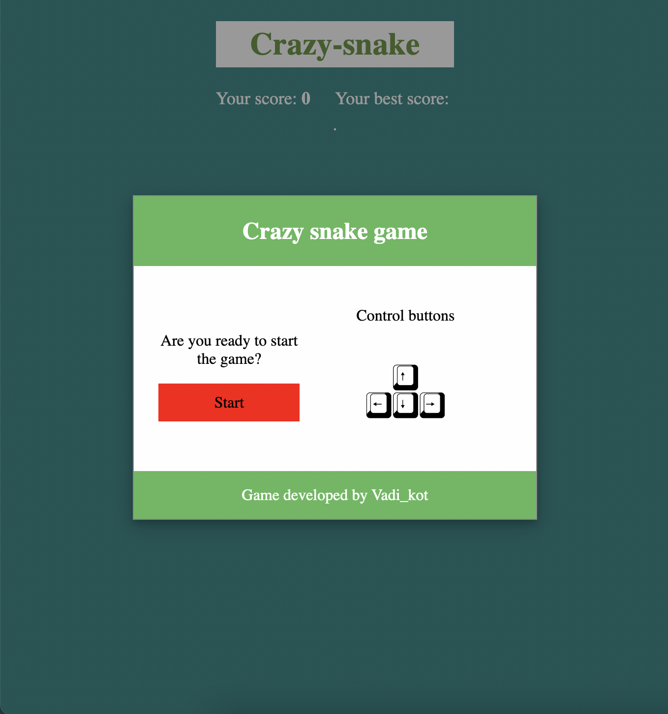
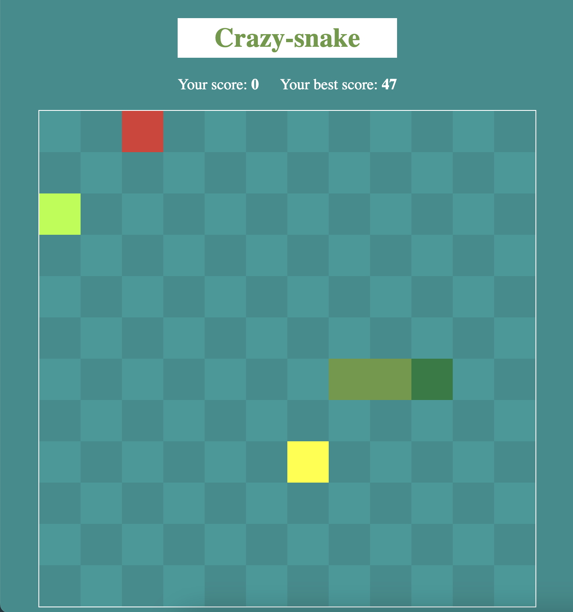

# Crazy snake game

The game is written in native JavaScript without using any libraries, frameworks and etc.

***Note: The main goal of this project is to learn javascript fundamentals and understanding how to create extensible
application, to be able to add new different cool ideas in the future.***

## Getting Started

1. Clone this project to your computer: `git clone https://github.com/vadikot/crazy-snake`
2. Open 'index.html' file in your browser.
3. Enjoy the game ;)

## Application screenshots

